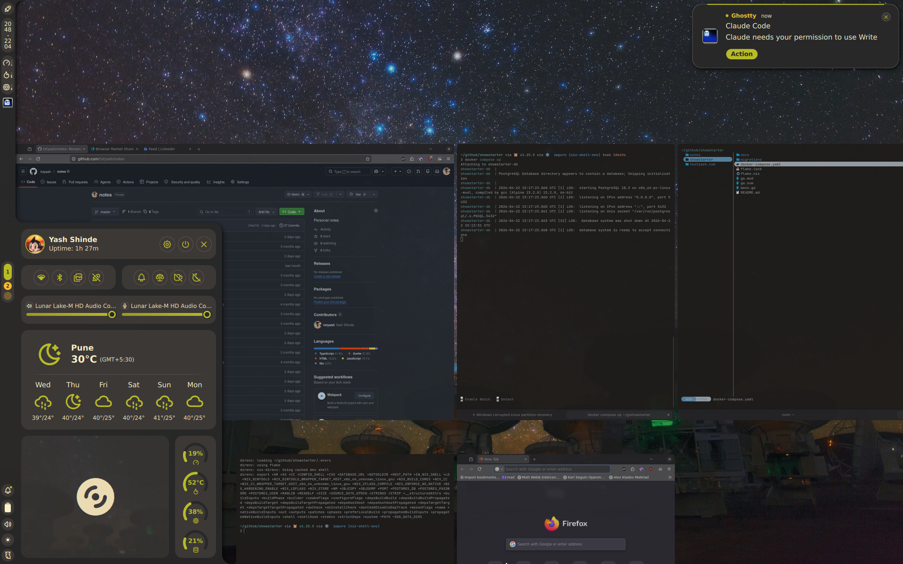

# Yash's dotfiles

## Setup

- [Niri window manager](https://github.com/niri-wm/niri)
- [Noctalia shell](https://noctalia.dev)

## Applications

- [Ghostty](https://ghostty.org)
- [Fish](https://fishshell.com) with [starship prompt](https://starship.rs)
- [Neovim](https://neovim.io)
- [Yazi](https://github.com/sxyazi/yazi)
- [Lazygit](https://github.com/jesseduffield/lazygit)
- [Claude Code](https://claude.com/product/claude-code)
- Firefox
- [Proton apps](https://proton.me)
